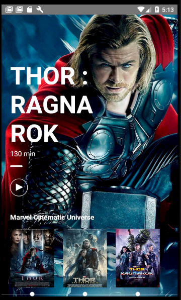
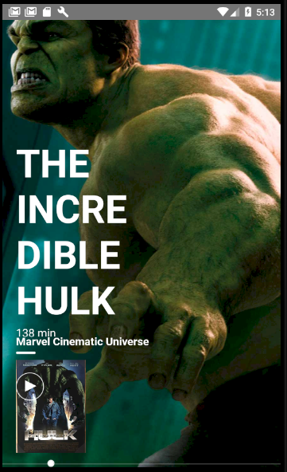
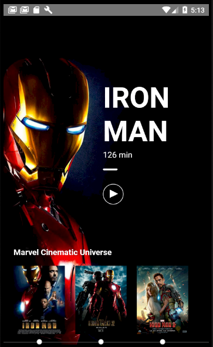
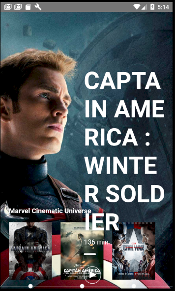
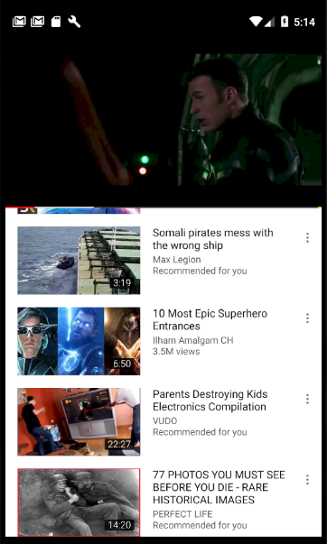

# Youtube App
React Native UI Challenge 

# Preview App

 
 
 

# How to use it

`npm i && react-native run-ios` || `yarn && react-native run-ios`

`npm i && react-native run-android` || `yarn && react-native run-android`

# TODO

- [x] Test on Android
- [x] Test on iOS
